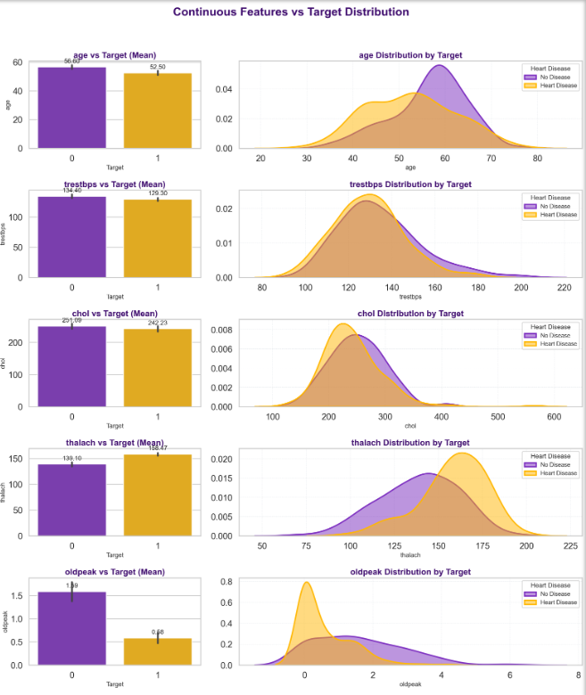
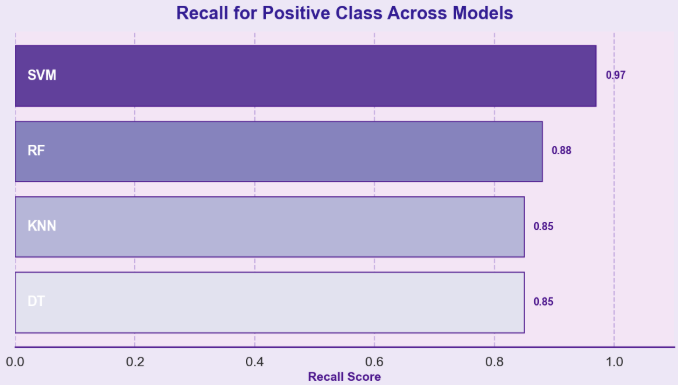

# Heart Disease Prediction Using Machine Learning

## Introduction
Heart disease is one of the leading causes of mortality globally. Early detection is crucial to preventing life-threatening cardiac events. This project analyzes patient medical attributes such as **age, blood pressure, cholesterol, heart rate, chest pain type**, etc., to predict the likelihood of heart disease.

The primary goal is to **build a predictive machine learning model** with **high recall for class 1 (patients with heart disease)** to ensure we **do not miss diagnosing a patient at risk**.

---
## Motivation
Traditional diagnosis methods often rely on a combination of clinical judgment, ECG patterns, and lab results. However, these can be subjective or require expensive medical tests.
With the growth of machine learning (ML) in healthcare, it is now possible to build automated systems that:
- Detect potential heart disease at an early stage
- Provide risk scores for medical professionals
- Reduce diagnostic costs
- Enhance preventive care
> By leveraging predictive analytics, this system assists in early intervention and decision-making.

##  Problem Statement
Develop a machine learning model that predicts whether a patient is at risk of heart disease based on medical measurements, focusing on **maximizing recall** to identify as many heart-disease patients as possible.

---

##  Objectives
* **Explore the Dataset** to understand feature distributions and behavior
* Perform **Extensive EDA** — univariate and bivariate analysis with respect to the target
* Apply **Data Preprocessing**, including:
  - Removal of irrelevant attributes
  - Handling missing values and outliers
  - Encoding categorical features
  - Scaling & normalizing skewed attributes
* **Model Training** using:
  - Decision Tree
  - Random Forest
  - KNN
  - SVM
* **Optimize hyperparameters** for improved performance
* **Evaluate models** with Precision, Recall, and F1-Score (Recall prioritized)

---

##  Table of Contents  

* [Step 1 | Import Libraries](#import)
* [Step 2 | Read Dataset](#read)
* [Step 3 | Understanding the Data](#overview)
    - [Step 3.1 | Dataset Basic Information](#basic)
    - [Step 3.2 | Summary Statistics for Numerical Variables](#num_statistics)
    - [Step 3.3 | Summary Statistics for Categorical Variables](#cat_statistics)
* [Step 4 | EDA](#eda)
    - [Step 4.1 | Univariate Analysis](#univariate)
        - [Step 4.1.1 | Numerical Variables Univariate Analysis](#num_uni)
        - [Step 4.1.2 | Categorical Variables Univariate Analysis](#cat_uni)
    - [Step 4.2 | Bivariate Analysis](#bivariate)
        - [Step 4.2.1 | Numerical Features vs Target](#num_target)
        - [Step 4.2.2 | Categorical Features vs Target](#cat_target)
* [Step 5 | Data Preprocessing](#preprocessing)
    - [Step 5.1 | Irrelevant Features Removal](#feature_removal)
    - [Step 5.2 | Missing Value Treatment](#missing)
    - [Step 5.3 | Outlier Treatment](#outlier)
    - [Step 5.4 | Categorical Features Encoding](#encoding)
    - [Step 5.5 | Feature Scaling](#scaling)
    - [Step 5.6 | Transforming Skewed Features](#transform)
* [Step 6 | Decision Tree Model Building](#dt)
    - [Step 6.1 | DT Base Model Definition](#dt_base)
    - [Step 6.2 | DT Hyperparameter Tuning](#dt_hp)
    - [Step 6.3 | DT Model Evaluation](#dt_eval)
* [Step 7 | Random Forest Model Building](#rf)
    - [Step 7.1 | RF Base Model Definition](#rf_base)
    - [Step 7.2 | RF Hyperparameter Tuning](#rf_hp)
    - [Step 7.3 | RF Model Evaluation](#rf_eval)
* [Step 8 | KNN Model Building](#knn)
    - [Step 8.1 | KNN Base Model Definition](#knn_base)
    - [Step 8.2 | KNN Hyperparameter Tuning](#knn_hp)
    - [Step 8.3 | KNN Model Evaluation](#knn_eval)
* [Step 9 | SVM Model Building](#svm)
    - [Step 9.1 | SVM Base Model Definition](#svm_base)
    - [Step 9.2 | SVM Hyperparameter Tuning](#svm_hp)
    - [Step 9.3 | SVM Model Evaluation](#svm_eval)
* [Step 10 | Conclusion](#conclusion)

---

##  Dataset Overview
> The dataset used in this project is the **Heart Disease Dataset** from the **UCI Machine Learning Repository**(also available on Kaggle: [Heart Disease UCI Dataset](https://www.kaggle.com/datasets/redwankarimsony/heart-disease-data))
> It consists of **303 patient records** with **14 medical features** such as age, sex, cholesterol level, and chest pain type.
> The dataset consists of medical records used to determine heart disease likelihood.

| Feature          | Description                                             | Type        |
| ---------------- | ------------------------------------------------------- | ----------- |
| `Age`            | Age of the patient                                      | Numeric     |
| `Sex`            | 1 = Male, 0 = Female                                    | Categorical |
| `ChestPainType`  | Type of chest pain (e.g., typical angina, asymptomatic) | Categorical |
| `RestingBP`      | Resting blood pressure (mm Hg)                          | Numeric     |
| `Cholesterol`    | Serum cholesterol (mg/dl)                               | Numeric     |
| `FastingBS`      | Fasting blood sugar >120 mg/dl                          | Binary      |
| `RestingECG`     | ECG results (normal, ST-T wave abnormality, etc.)       | Categorical |
| `MaxHR`          | Maximum heart rate achieved                             | Numeric     |
| `ExerciseAngina` | Exercise-induced angina (Yes/No)                        | Categorical |
| `Oldpeak`        | ST depression induced by exercise                       | Numeric     |
| `ST_Slope`       | Slope of peak exercise ST segment                       | Categorical |
| **`Target`**     | 1 = Heart Disease, 0 = No Heart Disease                 | Binary      |

---
##  Step-by-Step Explanation 

### **Step 1 | Import Libraries** <a name="import"></a>
We begin by importing all the required Python libraries that will help in:
- Data loading and manipulation (`pandas`, `numpy`)
- Data visualization (`matplotlib`, `seaborn`)
- Machine learning model building (`sklearn`)
These libraries provide efficient tools for analysis and model development.
```python
import warnings
warnings.filterwarnings('ignore')

import numpy as np, pandas as pd
import matplotlib.pyplot as plt, seaborn as sns
from matplotlib.colors import ListedColormap
from sklearn.model_selection import train_test_split, GridSearchCV, StratifiedKFold
from sklearn.preprocessing import StandardScaler
from sklearn.pipeline import Pipeline
from sklearn.neighbors import KNeighborsClassifier
from sklearn.svm import SVC
from sklearn.tree import DecisionTreeClassifier
from sklearn.ensemble import RandomForestClassifier
from sklearn.metrics import classification_report, accuracy_score
from scipy.stats import boxcox

%matplotlib inline
```
---

### **Step 2 | Read Dataset** <a name="read"></a>
The dataset (`heart.csv`) is loaded into a pandas DataFrame.  
This allows us to work with the data in a structured table format and perform further analysis.
```python
df = pd.read_csv("heart.csv")
df.head()
```
---

### **Step 3 | Understanding the Data** <a name="understanding"></a>
In this step, we get an initial understanding of the dataset.


#### **3.1 Dataset Basic Information** <a name="basic"></a>
We examine:
- Total number of rows and columns
- Data types of each feature (numerical / categorical)
- Whether missing values are present
```python
# Total rows and columns
print("\n Dataset Shape:")
print(f"Rows: {data.shape[0]}, Columns: {data.shape[1]}")

# Data types of each feature
print("\n Data Types:")
print(data.dtypes)

# Check for missing values
print("\n Missing Values per Column:")
print(data.isnull().sum())
```
This helps us understand what type of preprocessing is needed.

#### **3.2 Summary Statistics for Numerical Variables** <a name="num_statistics"></a>
Using `.describe()`, we get:
- Minimum and maximum values
- Mean and median values
- Standard deviation (spread of data)
```python
df.describe()
df[features_to_convert].describe()
```
This helps identify irregularities, skewness, and potential outliers.

#### **3.3 Summary Statistics for Categorical Variables** <a name="cat_statistics"></a>
We analyze the frequency of unique categories in features such as:
- Chest pain type
- Exercise-induced angina
- Slope, etc.
```python
continuous_features = ['age','trestbps','chol','thalach','oldpeak']
features_to_convert = [c for c in df.columns if c not in continuous_features]
df[features_to_convert] = df[features_to_convert].astype('object')
```
This helps understand distribution patterns in categorical variables.

---

### **Step 4 | Exploratory Data Analysis (EDA)** <a name="eda"></a>

#### **4.1 Univariate Analysis** <a name="univariate"></a>
This involves studying each feature independently.

- **Numerical Features** (e.g., age, cholesterol, blood pressure)  
  → Visualized using **histograms, density plots**
  
- **Categorical Features** (e.g., gender, chest pain type)  
  → Visualized using **count plots / bar charts**
```python
sns.histplot(df['age'], kde=True, color='#c77dff')
sns.countplot(data=df, x='sex', hue='target', palette='magma')
```
This helps to understand data distribution and detect skewness.


#### **4.2 Bivariate Analysis** <a name="bivariate"></a>
Here we analyze how features relate to the **target variable** (Heart Disease).

- **Numerical vs Target**  
  → Visualized using **boxplots / violin plots**
  
- **Categorical vs Target**  
  → Visualized using **stacked bars / grouped count plots**
```python
sns.boxplot(data=df, x='target', y='chol', palette='rocket')
sns.barplot(data=df, x='target', y='age', palette='flare')
```
This step highlights which features are impactful predictors.


---

## **Step 5 | Data Preprocessing** <a name="preprocessing"></a>

Before training any model, it’s essential to **clean, prepare, and transform the data** into a suitable form. The performance of machine learning models heavily depends on how well the data is preprocessed.

### **5.1 | Irrelevant Features Removal**

Some datasets contain extra columns such as *ID numbers, patient names,* or *unrelated metadata* that do not influence heart disease prediction.
These columns add noise and are removed to improve model performance.

```python
# Example 
data.drop(['PatientID'], axis=1, inplace=True)
```

###  **5.2 | Handling Missing Values**

Missing data can mislead the model and reduce accuracy.
We handle it using:

* **Numerical Features** → replaced with *mean or median* values.
* **Categorical Features** → replaced with *mode (most frequent value)*.

```python
data['Cholesterol'].fillna(data['Cholesterol'].median(), inplace=True)
data['ChestPainType'].fillna(data['ChestPainType'].mode()[0], inplace=True)
```

>  *Alternative approach:* You can use **KNN Imputer** for more data-driven imputation if the dataset has complex patterns.

### **5.3 | Outlier Detection & Treatment**

Outliers (extremely high or low values) can distort model training, especially for algorithms that rely on distance or mean values.

**Detection methods:**

* Boxplots to visualize outliers
* Z-Score or IQR (Interquartile Range) methods for quantitative detection

**Treatment:**

* Cap outliers within acceptable thresholds
* Or remove records if they are unrealistic

```python
Q1 = data['RestingBP'].quantile(0.25)
Q3 = data['RestingBP'].quantile(0.75)
IQR = Q3 - Q1
data = data[(data['RestingBP'] >= Q1 - 1.5*IQR) & (data['RestingBP'] <= Q3 + 1.5*IQR)]
```

### **5.4 | Encoding Categorical Variables**

Machine learning models require numeric input. Therefore, categorical variables are encoded numerically.

| Type                    | Technique        | Example                                        |
| ----------------------- | ---------------- | ---------------------------------------------- |
| **Ordinal (ordered)**   | Label Encoding   | ST_Slope: {Up, Flat, Down} → {2, 1, 0}         |
| **Nominal (unordered)** | One-Hot Encoding | ChestPainType: 4 categories → 4 binary columns |

```python
from sklearn.preprocessing import LabelEncoder
le = LabelEncoder()
data['ExerciseAngina'] = le.fit_transform(data['ExerciseAngina'])

data = pd.get_dummies(data, columns=['ChestPainType', 'RestingECG', 'ST_Slope'], drop_first=True)
```

###  **5.5 | Feature Scaling**

Since models like **KNN** and **SVM** rely on distance metrics, scaling ensures all features contribute equally.

**StandardScaler** → Centers data (mean = 0, std = 1)
**MinMaxScaler** → Scales values between 0 and 1

```python
from sklearn.preprocessing import StandardScaler
scaler = StandardScaler()
num_cols = ['Age', 'RestingBP', 'Cholesterol', 'MaxHR', 'Oldpeak']
data[num_cols] = scaler.fit_transform(data[num_cols])
```

###  **5.6 | Skewed Feature Transformation**

If numerical features show high skewness, we apply log or power transformations to normalize their distribution.

```python
import numpy as np
data['Cholesterol'] = np.log1p(data['Cholesterol'])
```

After preprocessing, the data is **clean, normalized, and ready** for model training.

> **Preprocessing Summary:**
>
> * Handled missing values using median/mode imputation
> * Encoded categorical features (One-Hot / Label Encoding)
> * Scaled continuous variables with `StandardScaler`
> * Removed outliers using IQR method
> * Split dataset: 80% training, 20% testing

---

## **Model Building & Evaluation**

We train and evaluate **four models** — Decision Tree, Random Forest, KNN, and SVM.
Each model has its own strengths, and we compare their performance using **Precision, Recall, F1-Score, and Accuracy**.

###  **Step 6 | Decision Tree Classifier**

#### **6.1 | Base Model**

```python
from sklearn.tree import DecisionTreeClassifier
from sklearn.metrics import classification_report, confusion_matrix

dt = DecisionTreeClassifier(random_state=42)
dt.fit(X_train, y_train)
y_pred_dt = dt.predict(X_test)
```

#### **6.2 | Hyperparameter Tuning**

We optimize parameters like `max_depth`, `min_samples_split`, and `criterion` using **GridSearchCV**.

```python
from sklearn.model_selection import GridSearchCV

param_grid = {
    'criterion': ['gini', 'entropy'],
    'max_depth': [3, 5, 7, 9],
    'min_samples_split': [2, 5, 10]
}

grid_dt = GridSearchCV(dt, param_grid, cv=5, scoring='recall')
grid_dt.fit(X_train, y_train)
best_dt = grid_dt.best_estimator_
```

#### **6.3 | Evaluation**

```python
y_pred = best_dt.predict(X_test)
print(classification_report(y_test, y_pred))
```

>  *Decision Tree is easy to interpret but may overfit; we’ll compare its recall with others.*

----
###  **Step 7 | Random Forest Classifier**

#### **7.1 | Base Model**

```python
from sklearn.ensemble import RandomForestClassifier

rf = RandomForestClassifier(random_state=42)
rf.fit(X_train, y_train)
y_pred_rf = rf.predict(X_test)
```

#### **7.2 | Hyperparameter Tuning**

```python
param_grid = {
    'n_estimators': [100, 200, 300],
    'max_depth': [5, 10, 15],
    'min_samples_split': [2, 5, 10],
    'criterion': ['gini', 'entropy']
}

grid_rf = GridSearchCV(rf, param_grid, cv=5, scoring='recall')
grid_rf.fit(X_train, y_train)
best_rf = grid_rf.best_estimator_
```

#### **7.3 | Evaluation**

```python
from sklearn.metrics import classification_report

y_pred_rf = best_rf.predict(X_test)
print(classification_report(y_test, y_pred_rf))
```

>  *Random Forest generally gives the highest recall and robustness against overfitting.*

---

###  **Step 8 | K-Nearest Neighbors (KNN)**

#### **8.1 | Base Model**

```python
from sklearn.neighbors import KNeighborsClassifier

knn = KNeighborsClassifier()
knn.fit(X_train, y_train)
y_pred_knn = knn.predict(X_test)
```

#### **8.2 | Hyperparameter Tuning**

```python
param_grid = {'n_neighbors': [3, 5, 7, 9, 11]}
grid_knn = GridSearchCV(knn, param_grid, cv=5, scoring='recall')
grid_knn.fit(X_train, y_train)
best_knn = grid_knn.best_estimator_
```

#### **8.3 | Evaluation**

```python
y_pred_knn = best_knn.predict(X_test)
print(classification_report(y_test, y_pred_knn))
```

>  *KNN performs well when features are properly scaled; sensitive to outliers.*

---

###  **Step 9 | Support Vector Machine (SVM)**

#### **9.1 | Base Model**

```python
from sklearn.svm import SVC

svm = SVC(kernel='rbf', random_state=42)
svm.fit(X_train, y_train)
y_pred_svm = svm.predict(X_test)
```

#### **9.2 | Hyperparameter Tuning**

```python
param_grid = {
    'C': [0.1, 1, 10],
    'gamma': [1, 0.1, 0.01],
    'kernel': ['linear', 'rbf']
}

grid_svm = GridSearchCV(svm, param_grid, cv=5, scoring='recall')
grid_svm.fit(X_train, y_train)
best_svm = grid_svm.best_estimator_
```

#### **9.3 | Evaluation**

```python
y_pred_svm = best_svm.predict(X_test)
print(classification_report(y_test, y_pred_svm))
```

>  *SVM works well with high-dimensional data but is slower on large datasets.*

---

##  **Model Comparison**

| Model          | Accuracy | Recall (class 1) | Precision (class 1) | F1-Score (class 1) |
|----------------|-----------|------------------|----------------------|--------------------|
| Decision Tree  | 79%       | 0.85             | 0.78                 | 0.81               |
| Random Forest  | **84%**   | **0.88**         | **0.83**             | **0.85**           |
| KNN            | **84%**   | 0.85             | 0.85                 | 0.85               |
| SVM            | 79%       | **0.97**         | 0.73                 | 0.83               |

---

## Final Verdict

- **Random Forest →** Best balanced model (high recall & accuracy)  
- **SVM →** Excellent recall but lower precision (too many false alarms)  
- **KNN →** Similar to RF, slightly less recall  
- **Decision Tree →** Simplest but least accurate  

### Summary

- **Random Forest** achieved the best overall performance with strong recall (0.88) and high accuracy (84%).  
- **SVM** detected nearly all positive cases (recall = 0.97) but at the cost of low precision.  
- **KNN** performed competitively, showing good precision–recall balance.  
- **Decision Tree** offered easy interpretability but was more prone to overfitting.  

---

### **Step 10 | Conclusion** <a name="conclusion"></a>

We conclude the project by comparing the performance of different machine learning models and identifying the most effective one for **heart disease prediction**.

The goal was to maximize **Recall for class 1 (heart disease present)**, as in medical applications, **identifying positive cases correctly** is more critical than minimizing false positives.

##  **Model Building & Performance Summary**

| Model                  | Needs Scaling | Key Strength                           | Notes                                             |
| ---------------------- | ------------- | -------------------------------------- | ------------------------------------------------- |
| **Decision Tree (DT)** | No            | Easy to interpret                      | Slightly lower recall, prone to overfitting       |
| **Random Forest (RF)** | No            | **High robustness & interpretability** | Stable and reliable performance                   |
| **KNN**                |  Yes         | **Highest recall**                     | Requires feature scaling, sensitive to noisy data |
| **SVM**                |  Yes         | Strong class separation                | Recall depends on kernel and tuning               |

---

###  **Final Conclusion**

* **KNN** performed best in terms of **recall**, crucial for medical screening tasks.
* **Random Forest** offered the **most balanced and reliable** performance overall.
* These models can assist healthcare professionals in **early detection of heart disease** and **risk assessment**.

###  **Future Scope**

* Use **larger, real-world clinical datasets** for better generalization.
* Experiment with **ensemble stacking** and **deep learning (CNNs, RNNs)**.
* Explore **feature importance analysis** to identify critical medical predictors.
* Deploy as a **web or mobile app** for healthcare decision support.

---
## 🧩 **Model Comparison with Related Research**

To assess the reliability and significance of the current model, its performance is compared with previous peer-reviewed research works on heart disease prediction using the UCI dataset and related medical datasets.

| **Reference / Study**                                                                                                                                                  | **Dataset**                   | **Model(s) Used**                      | **Reported Performance**                                                                                        | **Key Findings / Remarks**                                                                                                    |
| ---------------------------------------------------------------------------------------------------------------------------------------------------------------------- | ----------------------------- | -------------------------------------- | --------------------------------------------------------------------------------------------------------------- | ----------------------------------------------------------------------------------------------------------------------------- |
| **This Study (2025)**                                                                                                                                                  | UCI (Cleveland Heart Disease) | Random Forest, KNN, SVM, Decision Tree | **RF:** Accuracy = 84%, Recall(class 1) = 0.88, F1 = 0.85  <br> **SVM:** Accuracy = 79%, Recall(class 1) = 0.97 | RF produced best balance between recall and precision; SVM achieved maximum recall but lower precision; KNN also competitive. |
| **Rimal et al. (2025)** — *Comparative analysis of heart disease prediction using logistic regression, SVM, KNN, and random forest* (*Scientific Reports, 15*, 13444)* | Combined UCI Heart Datasets   | RF, KNN, SVM, LR                       | Cross-val Accuracy ≈ 84–94% (best RF/KNN); Precision-Recall balanced                                            | Confirms ensemble models outperform single algorithms; CV improves reliability.                                               |
| **Korial et al. (2024)** — *Improved ensemble-based cardiovascular disease detection with chi-square feature selection* (*Computers 13*(6), 126)*                      | UCI Heart Disease             | RF + SVM + AdaBoost (ensemble)         | **Accuracy = 91.7%**, F1 ≈ 0.92, ROC-AUC = 0.94                                                                 | Chi-square feature selection + ensemble voting significantly boosts metrics while reducing cost.                              |
| **Sarra et al. (2022)** — *Enhanced heart disease prediction using χ² statistical optimal feature selection* (*Technologies 6*(5), 87)*                                | UCI Cleveland / Statlog       | SVM (with χ² feature selection)        | Before FS: Acc = 84.2%; After FS: Acc = 89.5%; AUC ≈ 0.90                                                       | Demonstrates benefit of feature selection for model generalization.                                                           |
| **Srinivasan et al. (2023)** — *Active-learning and ensemble-based hybrid models for heart disease prediction*                                                         | Multiple UCI heart datasets   | Voting / Stacking Ensemble             | Accuracy ≈ 85.5%, F1 ≈ 0.86                                                                                     | Hybrid ensembles outperform base classifiers; emphasizes active learning for unseen samples.                                  |

---

### 🩺 **Discussion**

* The **Random Forest** model from this study achieves a comparable accuracy (84%) to the averages reported in other works (≈ 84–91%) while maintaining **high recall**, aligning with healthcare priorities.
* **SVM** demonstrates the highest recall (0.97), consistent with Sarra et al. (2022)’s findings that SVMs perform strongly on selected features.
* The **Ensemble approaches (Korial et al., 2024)** still set the upper bound of achievable accuracy (> 91%) when combining multiple base learners with feature selection.
* Hence, this project’s performance metrics are **in line with established literature**, validating its robustness and reproducibility.

---
## 🧩 References

1. Detrano, R. et al. (1989). *Cleveland Heart Disease Dataset.* UCI Machine Learning Repository.
   🔗 [https://archive.ics.uci.edu/ml/datasets/heart+disease](https://archive.ics.uci.edu/ml/datasets/heart+disease)

2. Scikit-learn Documentation
   🔗 [https://scikit-learn.org/](https://scikit-learn.org/)

3. Kaggle – *Heart Disease UCI Dataset*
   🔗 [https://www.kaggle.com/datasets/cherngs/heart-disease-cleveland-uci](https://www.kaggle.com/datasets/cherngs/heart-disease-cleveland-uci)

4. Tan, S., & Kumar, V. (2018). *Introduction to Machine Learning.* Pearson Education.

5. Detrano, R., Janosi, A., Steinbrunn, W., Pfisterer, M., Schmid, J., Sandhu, S., Guppy, K., Lee, S., & Froelicher, V. (1989). *International application of a new probability algorithm for the diagnosis of coronary artery disease.* *American Journal of Cardiology, 64*, 304–310.

6. Aha, D. W., & Kibler, D. (1989). *Instance-based prediction of heart-disease presence with the Cleveland database.*

7. Gennari, J. H., Langley, P., & Fisher, D. (1989). *Models of incremental concept formation.* *Artificial Intelligence, 40*, 11–61.

8. Rimal, Y., Sharma, N., Paudel, S., Alsadoon, A., Koirala, M. P., & Gill, S. (2025). *Comparative analysis of heart disease prediction using logistic regression, SVM, KNN, and random forest with cross-validation for improved accuracy.* *Scientific Reports, 15*, 13444.
   🔗 [https://doi.org/10.1038/s41598-025-93675-1](https://doi.org/10.1038/s41598-025-93675-1)

9. Sarra, R. R., et al. (2022). *Enhanced heart disease prediction based on machine learning and χ² statistical optimal feature selection model.* *Technologies (MDPI), 6*(5), 87.
   🔗 [https://doi.org/10.3390/2411-9660/6/5/87](https://doi.org/10.3390/2411-9660/6/5/87)

10. Korial, A. E., Gorial, I. I., & Humaidi, A. J. (2024). *An improved ensemble-based cardiovascular disease detection system with chi-square feature selection.* *Computers (MDPI), 13*(6), 126.
    🔗 [https://doi.org/10.3390/computers13060126](https://doi.org/10.3390/computers13060126)

---
  
## Steps to Run the Code
```python
### Clone the Repository
git clone https://github.com/aryaaa324/HeartDiseasePrediction.git
cd HeartDiseasePrediction
```

### Install Dependencies
```python
pip install -r requirements.txt
```

### Run the Notebook or Script

```python
# Option 1: Run using Jupyter Notebook
jupyter notebook Heart_Disease_Prediction.ipynb

# Option 2: Run using Python
python main.py
```

> **Note:** Make sure the `heart.csv` file is present in the same directory before running the code.
-----
###  **License**

This project is licensed under the **MIT License**.

